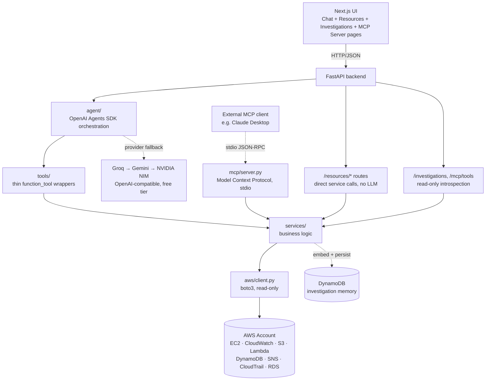

# OpsPilot AI

**An agentic AWS infrastructure investigation assistant.** Ask it about your infrastructure in plain English — it reasons over live EC2/CloudWatch data through multi-step tool calls, not a single canned lookup, and shows its reasoning trace, not just the final answer.


> Built an agentic AWS DevOps assistant using the OpenAI Agents SDK and FastAPI — the agent investigates infrastructure issues through multi-step reasoning over live CloudWatch/EC2 data, recalls semantically similar past investigations via a lightweight RAG pipeline, and exposes the same read-only tools through both a chat UI and a Model Context Protocol server, with full CI/CD and structured tracing of every tool call.

---

## What it does

- **Chat with your infrastructure.** Ask "what EC2 instances are running" or "is anything wrong with this instance" — the agent picks the right tool(s) itself.
- **Real multi-step investigation, not a single lookup.** For diagnostic questions, the agent runs a hypothesis → tool call → confirmed/contradicted → adjust → conclude loop: checks CPU load first, then instance/system health checks, then recent CloudTrail activity — ruling things out in order rather than guessing.
- **Visible reasoning trace.** Every chat response includes the actual sequence of tool calls and hypothesis narration behind it, expandable in the UI — not hidden behind the final answer.
- **Dashboard breadth across 7 services.** EC2 gets the deep investigation treatment; Lambda, S3, DynamoDB, SNS, RDS, and CloudTrail get live read-only status cards, each also answerable directly through chat.
- **Investigation memory (RAG).** Every chat investigation is embedded (Gemini) and persisted to DynamoDB. When a question sounds like something that may have come up before, the agent searches past investigations by cosine similarity and factors the match into its answer — no vector database needed at this scale. Browsable on the **Investigations** page.
- **Same tools, exposed as an MCP server too.** Every AWS tool the chat agent uses is also exposed via a [Model Context Protocol](https://modelcontextprotocol.io) server (`app/mcp/server.py`) — any MCP-compatible client (Claude Desktop, another agent) can query this account directly over stdio JSON-RPC, without going through this app's UI at all. Live tool list on the **MCP Server** page.
- **Zero AWS spend.** Built and run entirely within AWS's free-tier/credit-based Free Plan — see [`AWS_ZeroSpend_Setup_Guide.md`](./AWS_ZeroSpend_Setup_Guide.md).

## Demo

The core interaction: ask a diagnostic question like *"Is anything wrong with my EC2 instance?"* — the agent checks CPU load, then instance/system health checks, then recent CloudTrail activity, ruling out each hypothesis in turn before concluding. Every chat response includes an expandable reasoning trace showing the exact sequence of tool calls behind it, not just the final answer.

## Architecture



**Why this layering:** the agent never touches boto3 directly. `tools/` → `services/` → `aws/` means the investigation logic is unit-tested by mocking one function (the boto3 client factory), with zero dependency on the LLM being available or configured. The dashboard's `/resources/*` routes, the MCP server, and the agent's tools all call the exact same `services/` functions — three independent consumers of one service layer, structurally guaranteed to agree rather than coincidentally matching. See [Known limitations & accepted risks](#known-limitations--accepted-risks) below for the tradeoffs behind these choices (read-only scope, no IaC, no vector DB, etc.).

## Tech stack

| Layer | Choice |
|---|---|
| Backend | FastAPI, boto3, Pydantic, structured logging with request-ID tracing |
| Agent | OpenAI Agents SDK, `OpenAIChatCompletionsModel` wrapping OpenAI-compatible free-tier providers |
| LLM providers | Groq (primary) → Gemini Flash → NVIDIA NIM, automatic fallback, zero LLM spend |
| MCP | Official MCP Python SDK (`mcp[cli]`) — the same `services/` layer exposed over stdio JSON-RPC |
| RAG | Gemini `gemini-embedding-001` embeddings + DynamoDB, brute-force cosine similarity (no vector DB) |
| Frontend | Next.js 14 (App Router), TypeScript, Tailwind |
| Infra | AWS Free Plan, manual console provisioning (see setup guide), zero ongoing spend |
| CI | GitHub Actions — backend lint (ruff) + test (pytest) + Docker build; frontend lint + build |

## Running it locally

```bash
# Backend
cd opspilot-backend
python -m venv .venv && source .venv/bin/activate   # Windows: .venv\Scripts\activate
pip install -r requirements.txt
cp .env.example .env   # fill in AWS creds, instance ID, at least GROQ_API_KEY
uvicorn app.main:app --reload --port 8000

# Frontend (separate terminal)
cd opspilot-frontend
npm install
cp .env.local.example .env.local
npm run dev
```

Or via Docker Compose from the project root: `docker compose up --build`.

Full AWS account setup (zero-spend, step by step) is in [`AWS_ZeroSpend_Setup_Guide.md`](./AWS_ZeroSpend_Setup_Guide.md).

### Running tests

```bash
cd opspilot-backend
pip install -r requirements-dev.txt
ruff check .
pytest -v
```
Every test mocks the boto3 client factory directly — no AWS credentials or LLM API keys needed to run the suite.

## Known limitations & accepted risks

- **Read-only by design.** No AWS action in this project can create, modify, or delete anything — deliberate, for a portfolio demo. A write-action path would need an explicit approval/dry-run-diff workflow.
- **Single AWS account, single user.** No multi-tenancy or auth — out of scope for v1, flagged as a known gap rather than hidden.
- **Next.js 14 (EOL Oct 2025) with known unpatched CVEs.** All of them affect Server Actions, Middleware, the Image Optimization API, or WebSocket upgrades — none of which this app uses, and it only ever runs locally, never publicly deployed. Would upgrade to 16.x before any public deployment.
- **Chat is a single in-memory session.** The conversation shown in the UI resets on page refresh — nothing about a given back-and-forth is retained. Each individual investigation's *conclusion* is separately persisted to DynamoDB for RAG recall (see above), which is a different thing from turn-by-turn chat history.

## What's next

- **Terraform/CloudFormation** for the AWS resources currently provisioned manually via console (deliberately deferred — a single-account portfolio demo doesn't need IaC's reproducibility; would matter at scale)
- **Write actions** behind an explicit approval/dry-run workflow (e.g. "stop this instance" with a confirmation step)
- **Multi-account support**
- **LLM observability (Langfuse)** — tracing every agent turn, not just this project's own reasoning-trace UI
- **Slack/Teams integration** for the "agent sends an alert" flow the SNS topic is already wired for

## Interview-ready questions this project is built to answer

- Why agent tool-calling over a fixed dashboard?
- How would write-actions be added safely?
- What breaks at 10x scale?
- Why this LLM/SDK, and how does the Groq → Gemini → NVIDIA fallback work?
- What's one wrong turn the agent made during development, and how was it fixed?
- Why expose the same tools via MCP as well as a chat UI — what does that buy you?
- How does the RAG recall work without a vector database, and when would that stop being enough?
