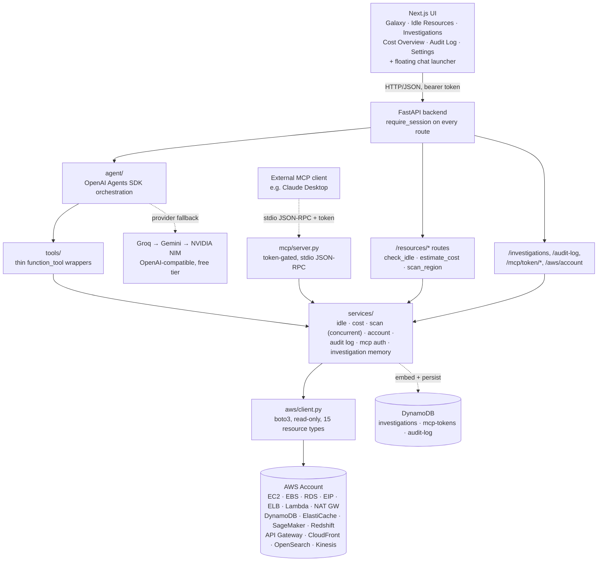

# OpsPilot AI

**An agentic AWS cost & idle-resource investigation platform.** A "galaxy" dashboard visualizes
every resource across 15 AWS services — sized by projected monthly cost, colored by idle status —
alongside a chat assistant that reasons over live AWS data through multi-step tool calls and shows
its reasoning trace, not just a final answer. The same tools are also exposed to any MCP-compatible
client (e.g. Claude Desktop) over a token-authenticated Model Context Protocol server.


> Built a full-stack agentic AWS cost/idle-resource platform: a Next.js "galaxy" dashboard
> visualizing 15 AWS resource types by cost and idle status, a FastAPI backend with region-wide
> concurrent scanning, an OpenAI Agents SDK-powered chat assistant with visible multi-step
> reasoning and RAG-based investigation memory, and a token-authenticated MCP server exposing the
> same read-only tools externally — with login-based auth, an audit log, and a documented security
> model throughout.

---

## What it does

- **Galaxy dashboard.** Every resource in the selected region rendered as a star — sized by
  projected monthly cost, colored by idle status (cyan = active, pulsing amber = idle 7+ days),
  grouped by family with a toggleable icon legend. Stars are draggable for a more explorable,
  "alive" layout. Click a star for a detail panel; click "View connections" to re-center into a
  bubble-map cluster showing that resource's related infrastructure (security group, subnet, VPC,
  IAM role, attached volumes) — answers "if I terminate this, what else is affected?"
- **All 15 in-scope AWS resource types**, one consistent `check_idle`/`estimate_cost` pattern per
  type: EC2, EBS, RDS, Elastic IP, ELB, Lambda, NAT Gateway, DynamoDB, ElastiCache, SageMaker
  endpoints, Redshift, API Gateway, CloudFront, OpenSearch, Kinesis.
- **Region-wide scanning**, concurrently. All 15 collectors for a region run in a bounded thread
  pool rather than sequentially, with per-region caching, a cooldown against accidental
  over-calling billed APIs, and graceful degradation — one resource type failing (e.g. a service
  the AWS account isn't opted into) never blanks the rest of the scan.
- **Idle Resources, Cost Overview, and Audit Log** as dedicated dashboard tabs, alongside Galaxy
  and Investigations — all reading from the same scan data, never a second source of truth.
- **Chat with your infrastructure**, as a floating launcher available from every page, not a
  top-level tab. Broad questions ("what's idle in this account", "what's my projected monthly
  spend", "list my S3 buckets") get a real answer with a breakdown, not a bare number. Diagnostic
  questions ("is anything wrong with this instance") run a hypothesis → tool call →
  confirmed/contradicted → adjust → conclude loop over CPU load, status checks, and recent
  CloudTrail activity, ruling things out in order instead of guessing.
- **Visible reasoning trace.** Every chat response includes the actual sequence of tool calls
  behind it, expandable in the UI — not hidden behind the final answer.
- **Investigation memory (RAG).** Every chat investigation is embedded (Gemini) and persisted to
  DynamoDB. When a question sounds like something that may have come up before, the agent searches
  past investigations by cosine similarity and factors the match into its answer — no vector
  database needed at this scale. Browsable on the **Investigations** page.
- **Same tools, exposed as a token-authenticated MCP server too.** Every tool the chat agent uses
  is also exposed via a [Model Context Protocol](https://modelcontextprotocol.io) server
  (`app/mcp/server.py`) — any MCP-compatible client (Claude Desktop, another agent) can query this
  account directly over stdio JSON-RPC. A token is required on every call, generated/revoked from
  **Settings → MCP Access**, stored bcrypt-hashed, never plaintext.
- **Login-gated, end to end.** Every frontend route and every backend API route independently
  requires a valid session — the frontend redirect is a UX nicety, not the security boundary.
- **Audit log.** MCP token generate/revoke and every login attempt (success or failure) write a
  durable, timestamped entry, browsable on the **Audit Log** tab.
- **Documented security model.** `docs/SECURITY.md` states the actual security posture as the code
  behaves today, including the one known accepted gap (static AWS IAM user keys, appropriate for
  this app's current single-admin/local-only scope) — not an aspirational claim.
- **Zero AWS spend, zero LLM spend.** Read-only IAM policy, Pricing API (not Cost Explorer) for
  cost estimates, and three free-tier LLM providers with automatic fallback.

## Architecture



**Why this layering:** the agent never touches boto3 directly. `tools/` → `services/` → `aws/`
means the investigation logic is unit-tested by mocking one function (the boto3 client factory),
with zero dependency on the LLM being available or configured. The dashboard's `/resources/*`
routes, the MCP server, and the agent's tools all call the exact same `services/` functions — three
independent consumers of one service layer, structurally guaranteed to agree rather than
coincidentally matching. See [Known limitations & accepted risks](#known-limitations--accepted-risks)
below for the tradeoffs behind these choices (read-only scope, static AWS keys, no vector DB, etc.).

## Tech stack

| Layer | Choice |
|---|---|
| Backend | FastAPI, boto3, Pydantic, structured logging with request-ID tracing |
| Agent | OpenAI Agents SDK, `OpenAIChatCompletionsModel` wrapping OpenAI-compatible free-tier providers |
| LLM providers | Groq (primary) → Gemini Flash → NVIDIA NIM, automatic fallback, zero LLM spend |
| MCP | Official MCP Python SDK (`mcp[cli]`) — the same `services/` layer exposed over token-gated stdio JSON-RPC |
| RAG | Gemini `gemini-embedding-001` embeddings + DynamoDB, brute-force cosine similarity (no vector DB) |
| Auth | NextAuth.js (Credentials provider) + FastAPI HS256 JWT session validation, shared-secret signed |
| Frontend | Next.js 14 (App Router), TypeScript, Tailwind — hand-rolled inline SVG icons, no icon library |
| Data stores | DynamoDB — `opspilot-investigations` (RAG), `opspilot-mcp-tokens`, `opspilot-audit-log` |
| Infra | AWS Free Plan, manual console provisioning (see `docs/iam-policy.json`), zero ongoing spend |
| CI | GitHub Actions — backend lint (ruff) + test (pytest) + Docker build; frontend lint + build |

## Running it locally

```bash
# Backend
cd opspilot-backend
python -m venv .venv && source .venv/bin/activate   # Windows: .venv\Scripts\activate
pip install -r requirements.txt
cp .env.example .env   # fill in AWS creds, at least one LLM provider key, and AUTH_SHARED_SECRET
uvicorn app.main:app --reload --port 8000

# Frontend (separate terminal)
cd opspilot-frontend
npm install
cp .env.local.example .env.local   # fill in NEXTAUTH_SECRET, ADMIN_EMAIL/ADMIN_PASSWORD_HASH,
                                    # and AUTH_SHARED_SECRET (must match the backend's value)
npm run dev
```

Every route is behind a login (email/password, single admin account — see
`docs/opspilot-ai-roadmap.md` Section 3.5): the frontend redirects to `/login` with no session, and
the backend independently rejects any API call without a valid bearer token, so hitting the API
directly without signing in first won't work either.

**AWS setup**: attach the policy in `docs/iam-policy.json` to the IAM user whose keys go in
`.env` (fill in your account ID), and create three DynamoDB tables — `opspilot-investigations`,
`opspilot-mcp-tokens`, `opspilot-audit-log` — each with a String partition key named `id`. The app
does not auto-create these tables.

**LLM provider**: at least one of `GROQ_API_KEY`, `GEMINI_API_KEY`, or `NVIDIA_API_KEY` must be
set for chat to work — the app tries them in that order and automatically falls back on failure or
rate limiting. All three have a free tier.

Or via Docker Compose from the project root: `docker compose up --build`.

### Running tests

```bash
cd opspilot-backend
pip install -r requirements-dev.txt
ruff check .
pytest -v
```
Every test mocks the boto3 client factory directly — no AWS credentials or LLM API keys needed to
run the suite.

## Known limitations & accepted risks

Full detail and reasoning in `docs/SECURITY.md` — summarized here:

- **Static, long-lived AWS IAM user keys**, not short-lived assumed-role sessions. A deliberate,
  documented tradeoff for this app's current single-admin/local-only scope — must be upgraded
  before hosting for or by anyone else. The attached IAM policy is least-privilege read-only
  regardless (Section 4 of `docs/SECURITY.md`), so exposure of these keys can't mutate AWS
  resources, only read them.
- **Single AWS account, single admin user.** No multi-tenancy — out of scope for v1, flagged as a
  known gap rather than hidden.
- **No rate limiting/lockout** on login or the MCP token path — accepted for a local-only tool,
  required before any internet-facing deployment.
- **Read-only by design.** No AWS action in this project can create, modify, or delete anything —
  the write-action/approval layer (dry-run + explicit confirmation) is intentionally the last,
  not-yet-built roadmap step, gated on a UX decision rather than built on autopilot.
- **Chat is a single in-memory session.** The conversation shown in the UI resets on page refresh.
  Each individual investigation's *conclusion* is separately persisted to DynamoDB for RAG recall,
  which is a different thing from turn-by-turn chat history.

## What's next

- **Write actions** behind an explicit approval/dry-run workflow (e.g. "stop this idle instance"
  with a confirmation step) — the last remaining roadmap item, deliberately gated on a UX
  conversation before being built
- **Short-lived assumed-role AWS sessions**, replacing the current static IAM user keys
- **Terraform/CloudFormation** for the AWS resources currently provisioned manually via console
- **Multi-account support**
- **LLM observability (Langfuse)** — tracing every agent turn, not just this project's own
  reasoning-trace UI
