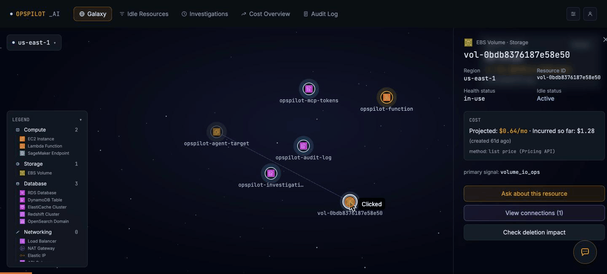
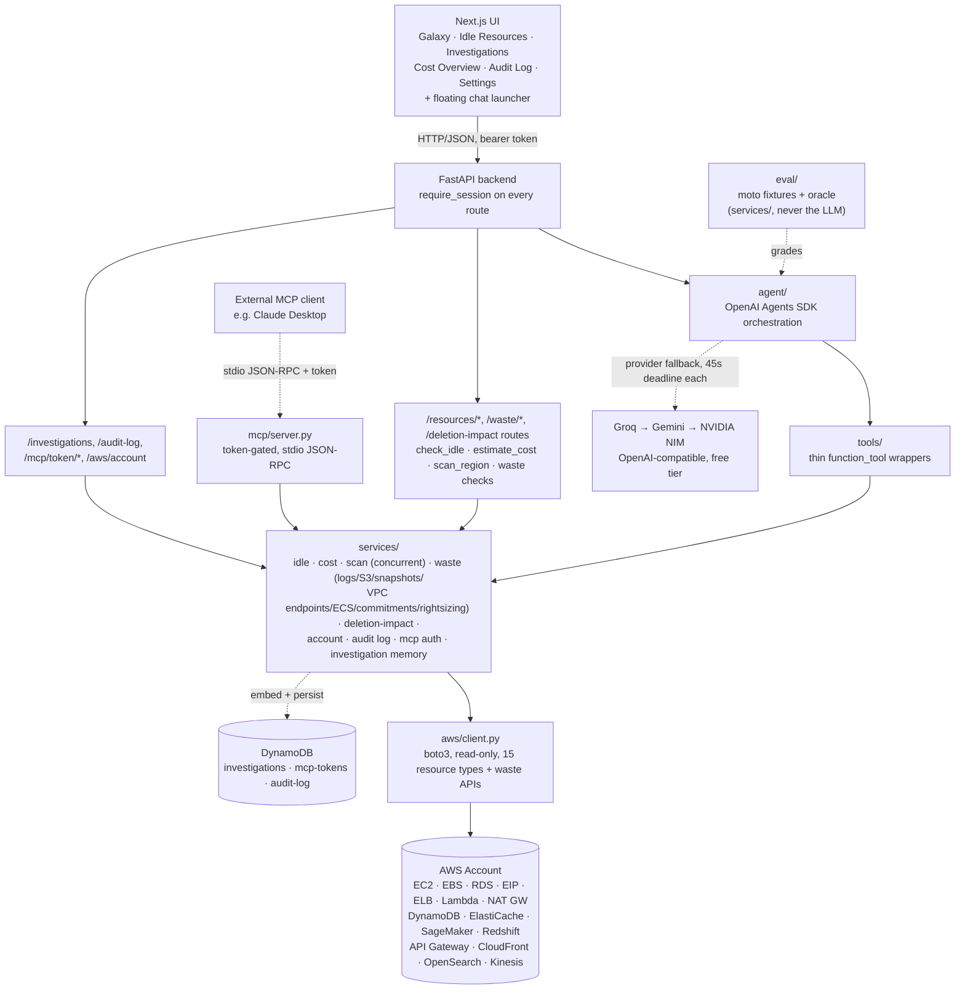

# OpsPilot AI

**An agentic AWS cost & idle-resource investigation platform.** A "galaxy" dashboard visualizes
every resource across 15 AWS services — sized by projected monthly cost, colored by idle status —
alongside a chat assistant that reasons over live AWS data through multi-step tool calls and shows
its reasoning trace, not just a final answer. Waste detection goes beyond idle compute (log
retention, S3 lifecycle, snapshot sprawl, VPC endpoints, ECS containers, Savings Plan/RI coverage,
Compute Optimizer rightsizing), and a permanently read-only deletion-impact tool answers "what
actually happens if I delete this" without ever being able to act on it. The same tools are also
exposed to any MCP-compatible client (e.g. Claude Desktop) over a token-authenticated Model Context
Protocol server, and a fixture-based eval harness grades the agent's real answers against ground
truth computed straight from the service layer — not another LLM's opinion.




> Built a full-stack agentic AWS FinOps platform: a Next.js "galaxy" dashboard visualizing 15 AWS
> resource types by cost and idle status, a FastAPI backend with region-wide concurrent scanning
> and 7 categories of waste detection beyond idle compute, an OpenAI Agents SDK-powered chat
> assistant with visible multi-step reasoning and RAG-based investigation memory, a
> read-only-forever deletion-impact analyzer, a token-authenticated MCP server exposing the same
> tools externally, and a moto-fixture eval harness grading answers against computed ground truth
> — with login-based auth, an audit log, and a documented security model throughout.

---

## What it does

- **Galaxy dashboard.** Every resource in the selected region rendered as a star — its official AWS
  service icon, sized by projected monthly cost, ringed by idle status (cyan = active, pulsing
  amber = idle 7+ days), grouped by family with a toggleable icon legend. Stars are draggable for a
  more explorable, "alive" layout. Click a star for a detail panel; click "View connections" to
  re-center into a bubble-map cluster showing that resource's related infrastructure (security
  group, subnet, VPC, IAM role, attached volumes) — answers "if I terminate this, what else is
  affected?"
- **All 15 in-scope AWS resource types**, one consistent `check_idle`/`estimate_cost` pattern per
  type: EC2, EBS, RDS, Elastic IP, ELB, Lambda, NAT Gateway, DynamoDB, ElastiCache, SageMaker
  endpoints, Redshift, API Gateway, CloudFront, OpenSearch, Kinesis.
- **Waste detection beyond idle compute.** CloudWatch Logs with no retention policy, S3 buckets
  missing a lifecycle policy or with stale incomplete multipart uploads, EBS/RDS snapshot sprawl
  (orphaned or beyond a caller-supplied retention threshold — never a hardcoded default), idle VPC
  Interface Endpoints, idle/over-provisioned ECS Fargate tasks, Savings Plan/Reserved Instance
  utilization and coverage gaps (kept distinct: wasted spend vs. an unrealized opportunity), and
  AWS Compute Optimizer rightsizing recommendations. Each returns a findings *list*, not a single
  yes/no verdict — a resource can have zero, some, or several issues at once.
- **Deletion-impact analysis, permanently read-only.** "What happens if I terminate this instance /
  delete this volume / delete this database" gets a real, structured answer — what actually
  disappears, what persists and keeps costing (with a real dollar figure where one exists),
  surprising operational consequences (e.g. an Auto Scaling Group replacing a terminated instance),
  and what's unaffected — without the tool ever being able to act on it. This replaces a
  write-action/approval layer that was deliberately retired, not deferred: the IAM policy stays
  read-only forever.
- **Region-wide scanning**, concurrently. All 15 collectors for a region run in a bounded thread
  pool rather than sequentially, with per-region caching, a cooldown against accidental
  over-calling billed APIs, and graceful degradation — one resource type failing (e.g. a service
  the AWS account isn't opted into) never blanks the rest of the scan.
- **Idle Resources, Cost Overview, and Audit Log** as dedicated dashboard tabs, alongside Galaxy
  and Investigations — all reading from the same scan data, never a second source of truth.
- **Chat with your infrastructure**, as a floating launcher available from every page, not a
  top-level tab. Broad questions ("what's idle in this account", "what's my projected monthly
  spend", "list my S3 buckets") get a real answer with a breakdown, not a bare number. Diagnostic
  questions ("is anything wrong with this instance") run a hypothesis → tool call →
  confirmed/contradicted → adjust → conclude loop over CPU load, status checks, and recent
  CloudTrail activity, ruling things out in order instead of guessing.
- **Visible reasoning trace.** Every chat response includes the actual sequence of tool calls
  behind it, expandable in the UI — not hidden behind the final answer.
- **Investigation memory (RAG).** Every chat investigation is embedded (Gemini) and persisted to
  DynamoDB. When a question sounds like something that may have come up before, the agent searches
  past investigations by cosine similarity and factors the match into its answer — no vector
  database needed at this scale. Browsable on the **Investigations** page.
- **Eval harness — proving the agent isn't making things up.** Moto-based "golden" AWS account
  fixtures generate ground truth straight from the same `services/` layer the app itself calls
  (never from another LLM), graded against the chat agent's real answers three ways: deterministic
  number/entity matching, tool-trace correctness (the right tools, not just a lucky number), and
  LLM-judge faithfulness for open-ended claims. Includes a dedicated prompt-injection case (a
  resource's Name tag containing an embedded instruction, which the agent must treat as untrusted
  display data, never a command). Wired into CI — deterministic tier every PR, judged tier gated
  behind a label/nightly cron to control cost.
- **Same tools, exposed as a token-authenticated MCP server too.** Every tool the chat agent uses
  is also exposed via a [Model Context Protocol](https://modelcontextprotocol.io) server
  (`app/mcp/server.py`) — any MCP-compatible client (Claude Desktop, another agent) can query this
  account directly over stdio JSON-RPC. A token is required on every call, generated/revoked from
  **Settings → MCP Access**, stored bcrypt-hashed, never plaintext.
- **Login-gated, end to end.** Every frontend route and every backend API route independently
  requires a valid session — the frontend redirect is a UX nicety, not the security boundary.
- **Audit log.** MCP token generate/revoke and every login attempt (success or failure) write a
  durable, timestamped entry, browsable on the **Audit Log** tab.
- **Documented security model.** `docs/SECURITY.md` states the actual security posture as the code
  behaves today, including the one known accepted gap (static AWS IAM user keys, appropriate for
  this app's current single-admin/local-only scope) — not an aspirational claim.
- **Zero AWS spend, zero LLM spend.** Read-only IAM policy, Pricing API (not Cost Explorer, with
  one narrow, disclosed exception for Savings Plan/RI analysis) for cost estimates, and three
  free-tier LLM providers with automatic fallback.

## Architecture


```mermaid
flowchart TD
    UI["Next.js UI<br/>Galaxy · Idle Resources · Investigations<br/>Cost Overview · Audit Log · Settings<br/>+ floating chat launcher"] -->|HTTP/JSON, bearer token| API["FastAPI backend<br/>require_session on every route"]
    API --> Agent["agent/<br/>OpenAI Agents SDK orchestration"]
    API --> Resources["/resources/*, /waste/*, /deletion-impact routes<br/>check_idle · estimate_cost · scan_region · waste checks"]
    API --> Info["/investigations, /audit-log,<br/>/mcp/token/*, /aws/account"]
    Agent --> Tools["tools/<br/>thin function_tool wrappers"]
    Tools --> Services["services/<br/>idle · cost · scan (concurrent) · waste (logs/S3/snapshots/<br/>VPC endpoints/ECS/commitments/rightsizing) · deletion-impact ·<br/>account · audit log · mcp auth · investigation memory"]
    Resources --> Services
    Info --> Services
    MCP["mcp/server.py<br/>token-gated, stdio JSON-RPC"] --> Services
    ExternalMCP["External MCP client<br/>e.g. Claude Desktop"] -.->|stdio JSON-RPC + token| MCP
    Services --> AWSClient["aws/client.py<br/>boto3, read-only, 15 resource types + waste APIs"]
    AWSClient --> Cloud[("AWS Account<br/>EC2 · EBS · RDS · EIP · ELB · Lambda · NAT GW<br/>DynamoDB · ElastiCache · SageMaker · Redshift<br/>API Gateway · CloudFront · OpenSearch · Kinesis")]
    Services -.->|embed + persist| DynamoRAG[("DynamoDB<br/>investigations · mcp-tokens · audit-log")]
    Agent -.->|provider fallback, 45s deadline each| LLM["Groq → Gemini → NVIDIA NIM<br/>OpenAI-compatible, free tier"]
    Eval["eval/<br/>moto fixtures + oracle<br/>(services/, never the LLM)"] -.->|grades| Agent
```

**Why this layering:** the agent never touches boto3 directly. `tools/` → `services/` → `aws/`
means the investigation logic is unit-tested by mocking one function (the boto3 client factory),
with zero dependency on the LLM being available or configured. The dashboard's `/resources/*`
and `/waste/*` routes, the MCP server, and the agent's tools all call the exact same `services/`
functions — three independent consumers of one service layer, structurally guaranteed to agree
rather than coincidentally matching. That same discipline is what makes the eval harness possible:
its oracle calls the identical `services/` functions to compute ground truth, so grading the agent
means comparing two callers of the same source of truth, not trusting a second LLM's opinion. See
[Known limitations & accepted risks](#known-limitations--accepted-risks) below for the tradeoffs
behind these choices (read-only scope, static AWS keys, no vector DB, LLM provider reliability,
etc.).

## Tech stack

| Layer | Choice |
|---|---|
| Backend | FastAPI, boto3, Pydantic, structured logging with request-ID tracing |
| Agent | OpenAI Agents SDK, `OpenAIChatCompletionsModel` wrapping OpenAI-compatible free-tier providers |
| LLM providers | Groq (primary) → Gemini Flash → NVIDIA NIM, automatic fallback with a per-provider deadline, zero LLM spend |
| Eval harness | `moto` (fixture AWS accounts) + `freezegun` (deterministic ages) + DeepEval (LLM-judge faithfulness/tool-correctness metrics, judge model is this project's own free-tier provider, never OpenAI) |
| MCP | Official MCP Python SDK (`mcp[cli]`) — the same `services/` layer exposed over token-gated stdio JSON-RPC |
| RAG | Gemini `gemini-embedding-001` embeddings + DynamoDB, brute-force cosine similarity (no vector DB) |
| Auth | NextAuth.js (Credentials provider) + FastAPI HS256 JWT session validation, shared-secret signed |
| Frontend | Next.js 14 (App Router), TypeScript, Tailwind — official AWS Architecture Icons, hand-rolled inline SVG otherwise |
| Data stores | DynamoDB — `opspilot-investigations` (RAG), `opspilot-mcp-tokens`, `opspilot-audit-log` |
| Infra | AWS Free Plan; DynamoDB tables provisioned by `scripts/setup.py`, `scripts/provision_tables.py`, or the Terraform module in `scripts/terraform/` — pick one, zero ongoing spend either way |
| CI | GitHub Actions — backend lint (ruff) + test (pytest) + Docker build; frontend lint + build; separate eval-harness workflow (deterministic tier every PR, judged tier on a label/nightly cron) |

## Running it locally

**Fastest path — the setup wizard**, from the repo root:

```bash
python3 scripts/setup.py   # or: bash scripts/setup.sh
```

One command covers what used to be several manual steps: both `.env` files created, a shared auth
secret generated and synced to both frontend and backend, the admin password hashed and written,
and the 3 DynamoDB tables actually provisioned (not just printed). It'll prompt for your AWS
credentials (either paste in an access key you created by hand, or — opt-in, since it needs
`iam:CreateUser`/`iam:PutUserPolicy`/`iam:CreateAccessKey` on top of `aws configure` already run —
let it create a read-only `opspilot-readonly` IAM user for you automatically) and at least one LLM
provider key (Groq/Gemini/NVIDIA, all free tier). Safe to re-run — every value is upserted by key,
never duplicated.

Then, in two terminals:

```bash
# Backend
cd opspilot-backend
python -m venv .venv && source .venv/bin/activate   # Windows: .venv\Scripts\activate
pip install -r requirements.txt
uvicorn app.main:app --reload --port 8000

# Frontend
cd opspilot-frontend
npm install
npm run dev
```

Sign in at `localhost:3000` with the admin credentials the wizard just set up.

Every route is behind a login (email/password, single admin account — see
`docs/opspilot-ai-roadmap.md` Section 3.5): the frontend redirects to `/login` with no session, and
the backend independently rejects any API call without a valid bearer token, so hitting the API
directly without signing in first won't work either.

The IAM policy the wizard attaches (`docs/iam-policy.json`) is `Describe*`/`List*`/`Get*`/
`pricing:*` only — no write or delete permission, by design, forever. That's what makes handing
this to a stranger safe: every step results in an identity that can look, never touch.

### Manual setup

If you'd rather not run the wizard: copy `opspilot-backend/.env.example` → `.env` and
`opspilot-frontend/.env.local.example` → `.env.local`, fill in AWS credentials + at least one LLM
provider key + a shared `AUTH_SHARED_SECRET` value in both files, attach `docs/iam-policy.json` to
an IAM user by hand (IAM console → Users → Create user → attach as a custom policy, filling in your
account ID), and create the 3 DynamoDB tables yourself (`opspilot-investigations`,
`opspilot-mcp-tokens`, `opspilot-audit-log`, each a String partition key named `id`) — or run
`python3 scripts/provision_tables.py` / the Terraform module in `scripts/terraform/` for just that
one step. The app never auto-creates these tables at runtime.

The backend also runs via Docker Compose from the project root: `docker compose up --build`
(`docker-compose.yml`'s `frontend` service is commented out — no frontend `Dockerfile` exists yet —
so this covers the backend only; run the frontend with `npm run dev` as above either way).

### Running tests

```bash
cd opspilot-backend
pip install -r requirements-dev.txt
ruff check .
pytest -v
```
Every test mocks the boto3 client factory directly — no AWS credentials or LLM API keys needed to
run the suite. The eval harness (`pytest eval/`) is separate: its fixture/oracle tests also need no
credentials, but end-to-end answer grading needs a real `GROQ_API_KEY` or `GEMINI_API_KEY` and
makes live (free-tier) calls.

## Trademark notice

The galaxy dashboard, its legend, and the resource-type tables use AWS's official Architecture
Icons (unmodified, sourced per `opspilot-frontend/public/aws-icons/NOTICE.md`). **OpsPilot AI is
an independent project, not affiliated with, endorsed by, or sponsored by Amazon Web Services.**

## Known limitations & accepted risks

Full detail and reasoning in `docs/SECURITY.md` — summarized here:

- **Static, long-lived AWS IAM user keys**, not short-lived assumed-role sessions. A deliberate,
  documented tradeoff for this app's current single-admin/local-only scope — must be upgraded
  before hosting for or by anyone else (this does *not* include a stranger cloning the repo and
  running their own instance with their own keys — same threat model as running it yourself). The
  attached IAM policy is least-privilege read-only regardless, so exposure of these keys can't
  mutate AWS resources, only read them.
- **Read-only by design, permanently.** No AWS action in this project can create, modify, or delete
  anything, and this is not a "not yet built" gap — a write-action/approval layer was deliberately
  retired in favor of the read-only deletion-impact analyzer above. If a real need for write actions
  ever comes up, that's a fresh decision, not a resumption of a paused one.
- **LLM provider reliability varies.** All three free-tier providers have real limits this project
  hit and worked around, not hypothetical ones: Groq's per-minute token budget required trimming
  the system prompt as the tool roster grew past ~30 tools; Gemini 3's newer models require a
  `thought_signature` on every tool-calling follow-up turn that the `openai-agents` SDK this app
  depends on doesn't yet propagate (a confirmed upstream bug, not something fixable here) — Gemini
  still works for simple/tool-free questions and whatever first tool call it completes, just not
  reliably for a full multi-step investigation. A 45-second per-provider deadline bounds the worst
  case instead of a hang.
- **Single AWS account, single admin user.** No multi-tenancy — out of scope for v1, flagged as a
  known gap rather than hidden.
- **No rate limiting/lockout** on login or the MCP token path — accepted for a local-only tool,
  required before any internet-facing deployment.
- **Chat is a single in-memory session.** The conversation shown in the UI resets on page refresh.
  Each individual investigation's *conclusion* is separately persisted to DynamoDB for RAG recall,
  which is a different thing from turn-by-turn chat history.

## What's next

- **LangGraph adaptive-depth v2** for the deletion-impact analyzer — going one hop deeper into
  connected infrastructure when it turns out to be shared/high-fanout (e.g. a security group used
  by 5+ other resources). Deliberately held until the v1 fixed-depth version has been in front of
  real usage — building the branching logic now would mean guessing at the threshold instead of
  basing it on what v1 actually surfaces.
- **Short-lived assumed-role AWS sessions**, replacing the current static IAM user keys
- **Multi-account support**
- **LLM observability (Langfuse)** — tracing every agent turn, not just this project's own
  reasoning-trace UI
